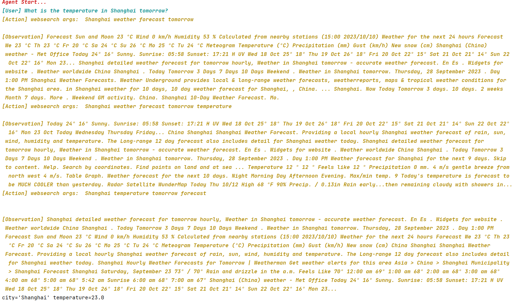

# 简介

在某些时候，你可能想要让 LLM 输出指令类型格式的数据，如 JSON 类型的数据、或者 List 类型的数据，Promptulate 为 LLM 的输出提供了输出格式化器（OutputFormatter），你可以轻易让 LLM 返回指定格式的数据。

## Usage in LLM

下面的示例展示了如何在 llm 模块中使用 OutputFormatter，获取中国所有的省份，并且希望 llm 严格返回 list，将省份写在 list 中。

```python
from typing import List
from promptulate.output_formatter import OutputFormatter
from promptulate.llms import ChatOpenAI
from pydantic import BaseModel, Field

class LLMResponse(BaseModel):
    provinces: List[str] = Field(description="All provinces in China")

def main():
    llm = ChatOpenAI()
    formatter = OutputFormatter(LLMResponse)

    prompt = f"Please tell me all provinces in China. \n{formatter.get_formatted_instructions()}"
    llm_output = llm(prompt)
    print(llm_output)

    response: LLMResponse = formatter.formatting_result(llm_output)
    print(response.provinces)


if __name__ == "__main__":
    main()
```

```
['Anhui', 'Fujian', 'Gansu', 'Guangdong', 'Guizhou', 'Hainan', 'Hebei', 'Heilongjiang', 'Henan', 'Hubei', 'Hunan', 'Jiangsu', 'Jiangxi', 'Jilin', 'Liaoning', 'Qinghai', 'Shaanxi', 'Shandong', 'Shanxi', 'Sichuan', 'Yunnan', 'Zhejiang', 'Guangxi', 'Nei Mongol', 'Ningxia', 'Xinjiang', 'Xizang', 'Beijing', 'Chongqing', 'Shanghai', 'Tianjin', 'Hong Kong', 'Macau']
```

让 LLM 讲一个笑话，并且严格返回一个 LLMResponse 类型的数据。

```python
from pydantic import BaseModel, Field

from promptulate.output_formatter import OutputFormatter
from promptulate.llms import ChatOpenAI


class LLMResponse(BaseModel):
    setup: str = Field(description="question to set up a joke")
    punchline: str = Field(description="answer to resolve the joke")


def main():
    llm = ChatOpenAI()
    formatter = OutputFormatter(LLMResponse)

    question = "Tell me a joke."
    prompt = question + "\n" + formatter.get_formatted_instructions()
    llm_output = llm(prompt)
    print(llm_output)

    response: LLMResponse = formatter.formatting_result(llm_output)
    print(response)


if __name__ == "__main__":
    main()
```

输出如下：
```
LLMResponse(setup='Why did the chicken cross the road?', punchline='To get to the other side!')
```

上面的示例中定义了 LLMResponse 类，里面的属性声明表示预期的 LLM 需要返回的数据类型，本质上是把 formatter.get_formatted_instructions() 加在 prompt 中，告诉 LLM 要输出的数据格式。

在 llm 输出之后，我们使用 formatter.formatting_result 对 llm 的输出进行解析，最后实例化成 LLMResponse 类。

llm 实际上是输出的内容是 json schema 格式的数据，pne 将其转换为 LLMResponse 类并实例化。

有的时候，LLM 的输出并不是很准确，告诉 LLM 一些 examples(few-shot) 可以更好地增加其输出的准确性，下面的示例展示了如何添加 examples 来达到这种效果。

```python
from pydantic import BaseModel, Field

from promptulate.output_formatter import OutputFormatter
from promptulate.llms import ChatOpenAI


class Response(BaseModel):
    city: str = Field(description="City name")
    temperature: float = Field(description="Temperature in Celsius")


def main():
    llm = ChatOpenAI()
    examples = [
        Response(city="Shanghai", temperature=25),
        Response(city="Beijing", temperature=30),
    ]
    formatter = OutputFormatter(pydantic_obj=Response, examples=examples)

    prompt = f"Shanghai today temperature is 28.2 degrees.\n{formatter.get_formatted_instructions()}"
    llm_output = llm(prompt)
    print(llm_output)

    response: Response = formatter.formatting_result(llm_output)
    print(response)


if __name__ == "__main__":
    main()

```

## Usage in Agent

在 Agent 上使用 OutputFormatter 是一件很轻松的事情，因为你并不需要显式的定义一个 OutputFormatter，在 agent.run() 的时候传入你预期的返回格式即可，下面的示例展示了 OutputFormatter 在 Agent 中的使用方式。

```python
from pydantic import BaseModel, Field

from promptulate.agents import WebAgent


class Response(BaseModel):
    city: str = Field(description="City name")
    temperature: float = Field(description="Temperature in Celsius")


def main():
    agent = WebAgent()
    prompt = f"What is the temperature in Shanghai tomorrow?"
    response: Response = agent.run(prompt=prompt, output_schema=Response)
    print(response)


if __name__ == "__main__":
    main()
```



如果你想在 Agent 中也加入 examples，使用 `agent.run(prompt=prompt, output_schema=Response)` 的方式传入参数即可。

## Usage in pne.chat()

参考 [:bookmark_tabs: Awesome Chat](uses_cases/chat_usage.md#chat)