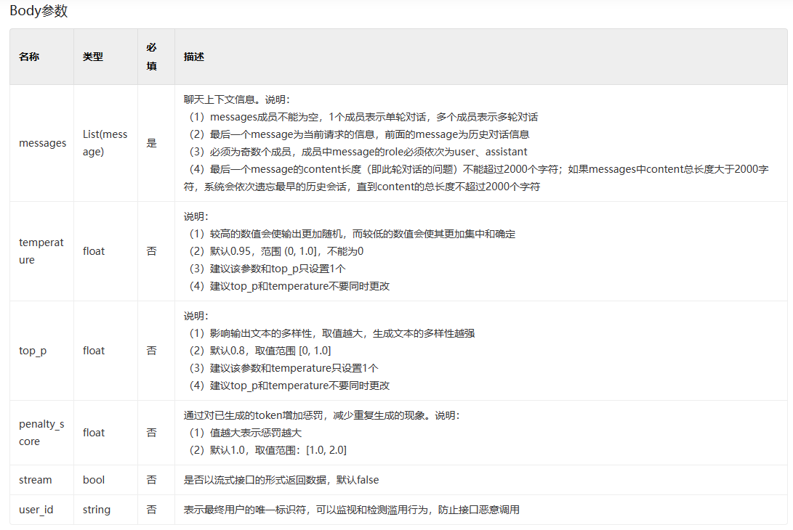

# 文心千帆系列模型

> 从 `v1.16.0` 版本开始，不在使用 llm 的概念，LLM 所有的功能都可以用 pne.chat() 来代替。只有当你需要自定义模型的时候，需要学习 [Custom LLM](modules/llm/custom_llm.md#custom-llm) 的使用方式。

本文将会介绍百度文心系列大模型的使用，要使用其能力，你需要前往[百度千帆大模型平台](https://console.bce.baidu.com/qianfan/ais/console/applicationConsole/application)创建大模型应用并安装
千帆sdk。安装命令如下

```shell script
pip install -U qianfan
```

### KEY配置

在使用百度千帆大模型平台系列的LLM之前，你需要先导入你的`API Key`和`Secret Key` ,具体请查看百度官方文档介绍(https://cloud.baidu.com/doc/WENXINWORKSHOP/s/3lmokh7n6)

**方法一（不推荐）**

```python
import os

os.environ["QIANFAN_ACCESS_KEY"] = "your api key"
os.environ["QIANFAN_SECRET_KEY"] =  "your secret key"
```

在你第一次使用的时候，需要使用`os.environ["QIANFAN_ACCESS_KEY"]` 导入"QIANFAN_ACCESS_KEY"的环境变量，但是在第一运行之后`promptulate`会进行缓存，即后面再运行就不需要再导入key了。同理QIANFAN_SECRET_KEY也有上述特性。

如果你的key过期了，可以尝试重新按照上面的方法导入key，或者你也可以把 `cache` 文件给删除掉，通过以下代码可以获取到缓存文件的位置:

```python
from promptulate.utils import get_default_storage_path

print(get_default_storage_path())
```

**方法二（推荐）**

方法二是 promptulate 官方推荐的最佳实践，你可以通过创建 `.env` 的方式来导入 key，与上面的配置效果是等价的。 [env 的使用方式](https://github.com/theskumar/python-dotenv)

在项目根目录下创建 `.env` 文件，然后填入你的 key:

```text
QIANFAN_ACCESS_KEY=xxx
QIANFAN_SECRET_KEY=xxx
```

### LLM快速上手

`promptulate`的架构设计可以轻松兼容不同的大语言模型扩展，在`promptulate`中，llm负责最基本的内容生成部分，因此为最基础的组件。

下面的示例展示了如何使用百度文心千帆的大语言模型进行交互。

如果你想使用国产文心系列模型，只需要 QianFan()进行初始化，文心模型虽然与openai模型有较大差异，但是框架提供了尽可能完美的兼容。
你还可以使用QianFan(model="ERNIE-Bot-4")来具体选择对应的文心模型，目前框架基本支持所有的文心系列模型，分别是


本框架默认为性能更加强大的文心4.0模型。


```python
from promptulate.llms import QianFan

llm = QianFan() 
answer = llm("请解释一下引力波的放射与广义相对论的必然关系")
print(answer)

```

> 上述ErnieBot默认使用`ERNIE-Bot-4`模型

输出结果如下：

```text
广义相对论是一种描述引力如何影响时空的物理学理论，它指出当物质和能量聚集在一起时，它们弯曲了周围的时空，引起了引力。质量和能量更大的物体会导致更大
的时空弯曲，这就是为什么地球会围绕太阳旋转。根据广义相对论，当物质或能量在空间中运动时，它们会产生引力波，就像在水面上产生涟漪一样。引力波是一种类
似电磁波的波动，但它们是由物质和能量的弯曲引起的，而电磁波是由电荷的振动引起的。引力波是极微弱的，但是当强烈的引力场存在（例如在引力天体碰撞或超新
星爆炸等事件中），它们可以被探测到。事实上，2015年，激光干涉引力波天文台利用引力波探测器直接探测到了引力波，并为广义相对论提供了强有力的证据。因
此，引力波的放射与广义相对论必然关系紧密。通过引力波，我们可以更加深入地了解时空的性质，并进一步验证这个理论。
```

### 切换模型

文心千帆提供了一系列大模型,详情介绍查看[官方文档](https://cloud.baidu.com/doc/WENXINWORKSHOP/s/Jlfmc9dit)与[API文档](https://cloud.baidu.com/doc/WENXINWORKSHOP/s/Nlks5zkzu)
以下是其中一些大模型的介绍

**ERNIE-Bot-turbo**

文心一言人工智能大语言模型，拥有产业级知识增强文心大模型ERNIE，具备跨模态、跨语言的深度语义理解与生成能力。

**ERNIE-Bot**

文心一言大语言模型，基于飞桨深度学习平台和文心知识增强的强大模型，持续从海量数据和大模型知识中融合学习。具备知识增强、检索增强和对话增强的技术特色。

**ERNIE-Bot-4**

ERNIE-Bot 4.0是百度自行研发的大语言模型，覆盖海量中文数据，具有更强的对话问答、内容创作生成等能力。

你可以使用如下方式切换模型：

```python
from promptulate.llms import QianFan

llm = QianFan(model="ERNIE-Bot-turbo") 
answer = llm("请解释一下引力波的放射与广义相对论的必然关系")
print(answer)
```

### 参数配置

ErnieBot相关模型的参数如下所示：



你可以使用如下方式进行参数配置：

```python
from promptulate.llms import QianFan

model_config = {"temperature": 0.1, "top_p": 0.8}

llm = QianFan(model_config=model_config) 
answer = llm("请解释一下引力波的放射与广义相对论的必然关系")
print(answer)
```

### Stop停词

什么是Stop停词？事实上，stop是一个字符串数组，如`["action", "observation"]`，在LLM生成文本的过程中，如果检测到LLM当前生成本文为stop数组里的内容，则LLM就会停止文本生成，该功能一般用于一些复杂应用程序的开发上，下面的示例展示了stop的使用。

> 文心4.0已经完美支持停词功能，因此框架提供的兼容性停词被废弃。
> 当模型生成结果以stop中某个元素结尾时，停止文本生成。官方说明如下：

**（1）每个元素长度不超过20字符**

**（2）最多4个元素**

```python
from promptulate.llms import QianFan

model_config = {"temperature": 0.1, "stop": ["a"]}
llm = QianFan(model_config=model_config)
prompt = """
Please strictly output the following content.
[start] This is a test [end]
"""
result = llm(prompt)
print(result)
```

输出结果如下：

```text
[st
```

### 流式输出

如果你想要流形式输出，你可以按照如下方式进行流输出

```python
from promptulate.llms import QianFan

model_config = {"stream": True}
llm = QianFan(model_config=model_config)

response = llm("Who are you?")

for chuck in response:
    print(chuck)
```

QianFan()将返回一个迭代器，您可以使用next()或for each来获取响应。
如果您想获取元数据，可以使用return_raw_response=True来获取pne包装的原始响应。助理消息。元数据将存储在pne.AssistantMessage.additional_kwargs。

```python
from promptulate.llms import QianFan

model_config = {"stream": True, "return_raw_response": True}
llm = QianFan(model_config=model_config)

response = llm("Who are you?")
for chuck in response:
    print(chuck.content)
    print(chuck.additional_kwargs)
```
