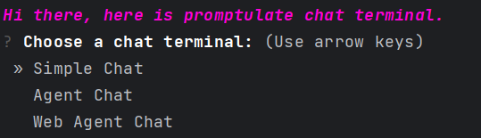
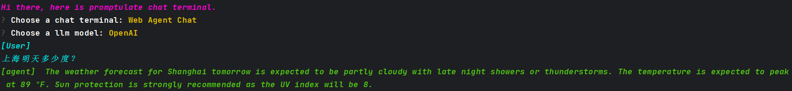

# 快速开始

通过该部分教学，你可以快速对 promptulate 有一个整体的认知，一些常用模块的基本使用方式，在阅读完该部分之后，你可以继续阅读 [User Cases](modules/usercases/intro.md#user-cases) 来了解 promptulate 的一些最佳实践，在遇到问题的时候，可以查看每个模块的具体使用方式，也欢迎你在 [issue](https://github.com/Undertone0809/promptulate/issues) 中为 promptulate 提供更好的建议。

## 安装最新版

打开终端，输入下面命令下载`promptulate`最新版，`-U`表示更新到最新版，如果你已经下载`promptulate`
旧版本，那么执行此命令会更新到最新版。`promptulate`当前正处于快速发展阶段，因此你可能需要经常更新最新版以享用最新的成果。

```shell script
pip install -U promptulate  
```

> 有的时候我们会将promptulate称之为`pne`,其中p和e表示promptulate开头和结尾的单词，而n表示9，即p和e中间的九个单词的简写。

## 基本使用

> 下列教程全部使用`OPENAI gpt-3.5-turbo`进行测试

该部分将会介绍`promptulate`中一些常用组件的基本使用，带你快速了解`promptulate`的架构组成，快速上手部分仅仅提供最简单的使用，如果你有开发复杂应用程序的需求，请跳转至各个模块进行功能的详细阅读。


### KEY配置

在使用`promptulate`之前，你需要先导入你的`OPENAI_API_KEY`，你可以使用两种方式进行导入。

**方法一（不推荐）**

```python
import os

os.environ['OPENAI_API_KEY'] = "your-key"
```

在你第一次使用的时候，需要使用`os.environ["OPENAI_API_KEY"]` 导入"OPENAI_API_KEY"的环境变量，但是在第一运行之后`promptulate`会进行缓存，即后面再运行就不需要再导入key了。

如果你的key过期了，可以尝试重新按照上面的方法导入key，或者你也可以把 `cache` 文件给删除掉，通过以下代码可以获取到缓存文件的位置:

```python
from promptulate.utils import get_default_storage_path

print(get_default_storage_path())
```

**方法二（推荐）**

方法二是 promptulate 官方推荐的最佳实践，你可以通过创建 `.env` 的方式来导入 key，与上面的配置效果是等价的。 [env 的使用方式](https://github.com/theskumar/python-dotenv)

在项目根目录下创建 `.env` 文件，然后填入你的 key:

```text
OPENAI_API_KEY=sk-xxx
```

### LLM

> 详细文档请跳转[LLM](modules/llm/llm.md#llm)

`promptulate`的架构设计可以轻松兼容不同的大语言模型扩展，在`promptulate`中，llm负责最基本的内容生成部分，因此为最基础的组件。

下面的示例展示了如何使用OpenAI进行交互。

```python
from promptulate.llms import ChatOpenAI

llm = ChatOpenAI()
answer = llm("请解释一下引力波的放射与广义相对论的必然关系")
print(answer)

```

输出结果如下：

```text
广义相对论是一种描述引力如何影响时空的物理学理论，它指出当物质和能量聚集在一起时，它们弯曲了周围的时空，引起了引力。质量和能量更大的物体会导致更大
的时空弯曲，这就是为什么地球会围绕太阳旋转。根据广义相对论，当物质或能量在空间中运动时，它们会产生引力波，就像在水面上产生涟漪一样。引力波是一种类
似电磁波的波动，但它们是由物质和能量的弯曲引起的，而电磁波是由电荷的振动引起的。引力波是极微弱的，但是当强烈的引力场存在（例如在引力天体碰撞或超新
星爆炸等事件中），它们可以被探测到。事实上，2015年，激光干涉引力波天文台利用引力波探测器直接探测到了引力波，并为广义相对论提供了强有力的证据。因
此，引力波的放射与广义相对论必然关系紧密。通过引力波，我们可以更加深入地了解时空的性质，并进一步验证这个理论。
```

### 客户端

`promptulate`为大语言模型对话提供了一个简易终端，在你安装了 `promptulate` 之后，你可以非常方便的使用这个简易终端进行一些对话，具体包括：

- 基于大模型的**简单对话**
- 选择特定工具进行 **Agent 对话**
- LLM + WebSearch 进行**基于网络搜索的对话**



**快速上手**

- 打开终端控制台，输入以下命令，就可以开启一个简易的对话

```shell
pne-chat
```

- 然后你就可以随着 `pne`的引导进行操作



```text
Hi there, here is promptulate chat terminal.
? Choose a chat terminal: Web Agent Chat
? Choose a llm model: OpenAI
[User] 
上海明天多少度？
[agent]  The weather forecast for Shanghai tomorrow is expected to be partly cloudy with late night showers or thunderstorms. The temperature is expected to peak
 at 89 °F. Sun protection is strongly recommended as the UV index will be 8.
```

### Agent

Agent是`promptulate`的核心组件之一，其核心思想是使用llm、Tool、Memory、Provider、Output Formatter等组件来构建起的一个可以处理复杂能力的代理。

下面的示例展示了如何使用`ToolAgent`结合Tool进行使用。

```python
from promptulate.tools import (
    DuckDuckGoTool,
    Calculator,
)
from promptulate.agents import ToolAgent


def main():
    tools = [
        DuckDuckGoTool(),
        Calculator(),
    ]
    agent = ToolAgent(tools)
    prompt = """Who is Leo DiCaprio's girlfriend? What is her current age raised to the 0.43 power?"""
    agent.run(prompt)


if __name__ == "__main__":
    main()

```

运行结果如下：


```text
Agent Start...
[user] Who is Leo DiCaprio's girlfriend? What is her current age raised to the 0.43 power?
[Action] ddg-search args: Leo DiCaprio's girlfriend
[Observation] Sarah Stier // Getty Images March 2021: They enjoy a beachside getaway. DiCaprio and Morrone headed to Malibu with friends for brief holiday. The actress shared photos from their trip to... His last relationship, with actor and model Camila Morrone, ended this past August, shortly after she turned 25. If there are two things people love, it's observing patterns, and having those... Celebrities. Vanessa Bryant remembers late husband, Kobe, on what would have been his 45th birthday Leonardo DiCaprio has once more found love. Aligning with his established preferences, the... Who is Leonardo DiCaprio's girlfriend? It's unknown if Leonardo DiCaprio is dating anyone at this time. However, he was spotted at Coachella dancing with model Irina Shayk. Shayk is Bradley... After more than four years of dating, Leonardo DiCaprio and Camila Morrone are going their separate ways. In August, multiple sources told PEOPLE that the longtime couple has broken up. The...
[Action] ddg-search args: Camila Morrone age
[Observation] Camila Morrone: her birthday, what she did before fame, her family life, fun trivia facts, popularity rankings, and more. Fun facts: before fame, family life, popularity rankings, and more. popular trending video trivia random Camila Morrone. Actress: Death Wish. Camila Morrone is an American model and actress. Morrone was born in Los Angeles, California to Argentine parents Lucila Solá and Máximo Morrone. Her mother is a former model and was a companion to actor Al Pacino, who is also her stepfather. Morrone started her career as a model and has appeared on the cover page of Vogue Turkey in 2016. However, Morrone — who is 23 years younger than DiCaprio — did comment on their age difference in December 2019, telling the Los Angeles Times, "I just think anyone should be able to date who... Two months ago she turned 25 and until recently she was in a relationship with Oscar winning actor Leonardo DiCaprio. In December 2017 her name went around the world, when rumors of romance with the actor began and especially because of the age difference between them. DiCaprio tends to date women between the ages of 20 and 25, prompting some to lose their minds over the mere possibility of his next girlfriend being born in the 2000s. "there's no phenomenon on...
[Action] math-calculator args: 25^0.43
[Observation] 3.991298452658078
[Agent Result]  Camila Morrone's current age raised to the 0.43 power is approximately 3.99.
Agent End.
```

### Output Formatter

很多时候，LLM 的输出具有很强的不可控性，promptulate 通过 JSON schema 为 LLM 的输出构建了一个输出格式化器，简单来说，你可以用这种方式制定 LLM 的输出内容，并转换成一个 python 对象。

下面的示例展示了在 WebAgent 中使用格式化输出的最佳实践：

```python
from pydantic import BaseModel, Field

from promptulate.agents import WebAgent


class Response(BaseModel):
    city: str = Field(description="City name")
    temperature: float = Field(description="Temperature in Celsius")


def main():
    agent = WebAgent()
    prompt = f"What is the temperature in Shanghai tomorrow?"
    response: Response = agent.run(prompt=prompt, output_schema=Response)
    print(response.city, response.temperature)


if __name__ == "__main__":
    main()
```


## 更多

本文仅展示了`promtptulate`的一些简单使用，具体功能详情请查看文档查看具体实现。