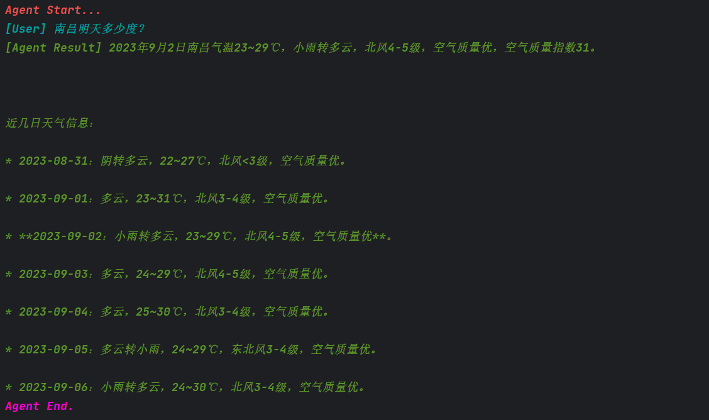
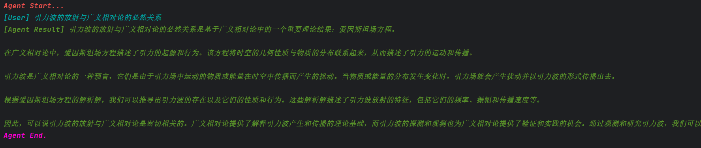

# Agent

Agent是`promptulate`的核心组件之一，其核心思想是使用llm、Tool、Memory、Provider,Output Formatter等组件来构建起的一个可以处理复杂能力的代理。

## ToolAgent

下面的示例展示了如何使用`ToolAgent`结合Tool进行使用。

```python
import promptulate as pne
from promptulate.tools import DuckDuckGoTool, Calculator


def main():
    tools = [
        DuckDuckGoTool(),
        Calculator(),
    ]
    agent = pne.ToolAgent(tools=tools)
    prompt = """Who is Leo DiCaprio's girlfriend? What is her current age raised to the 0.43 power?"""
    agent.run(prompt)


if __name__ == "__main__":
    main()

```

运行结果如下：


```text
Agent Start...
[user] Who is Leo DiCaprio's girlfriend? What is her current age raised to the 0.43 power?
[Action] ddg-search args: Leo DiCaprio's girlfriend
[Observation] Sarah Stier // Getty Images March 2021: They enjoy a beachside getaway. DiCaprio and Morrone headed to Malibu with friends for brief holiday. The actress shared photos from their trip to... His last relationship, with actor and model Camila Morrone, ended this past August, shortly after she turned 25. If there are two things people love, it's observing patterns, and having those... Celebrities. Vanessa Bryant remembers late husband, Kobe, on what would have been his 45th birthday Leonardo DiCaprio has once more found love. Aligning with his established preferences, the... Who is Leonardo DiCaprio's girlfriend? It's unknown if Leonardo DiCaprio is dating anyone at this time. However, he was spotted at Coachella dancing with model Irina Shayk. Shayk is Bradley... After more than four years of dating, Leonardo DiCaprio and Camila Morrone are going their separate ways. In August, multiple sources told PEOPLE that the longtime couple has broken up. The...
[Action] ddg-search args: Camila Morrone age
[Observation] Camila Morrone: her birthday, what she did before fame, her family life, fun trivia facts, popularity rankings, and more. Fun facts: before fame, family life, popularity rankings, and more. popular trending video trivia random Camila Morrone. Actress: Death Wish. Camila Morrone is an American model and actress. Morrone was born in Los Angeles, California to Argentine parents Lucila Solá and Máximo Morrone. Her mother is a former model and was a companion to actor Al Pacino, who is also her stepfather. Morrone started her career as a model and has appeared on the cover page of Vogue Turkey in 2016. However, Morrone — who is 23 years younger than DiCaprio — did comment on their age difference in December 2019, telling the Los Angeles Times, "I just think anyone should be able to date who... Two months ago she turned 25 and until recently she was in a relationship with Oscar winning actor Leonardo DiCaprio. In December 2017 her name went around the world, when rumors of romance with the actor began and especially because of the age difference between them. DiCaprio tends to date women between the ages of 20 and 25, prompting some to lose their minds over the mere possibility of his next girlfriend being born in the 2000s. "there's no phenomenon on...
[Action] math-calculator args: 25^0.43
[Observation] 3.991298452658078
[Agent Result]  Camila Morrone's current age raised to the 0.43 power is approximately 3.99.
Agent End.
```

Agent默认使用OpenAI的`gpt-3.5-turbo-16k`模型，如果你想要切换为其他模型，你可以使用如下方式进行配置：

```python
import promptulate as pne
from promptulate.tools import DuckDuckGoTool, Calculator


def main():
    llm = pne.llms.ErnieBot(temperature=0.1)
    tools = [
        DuckDuckGoTool(),
        Calculator(),
    ]
    agent = pne.ToolAgent(tools=tools,llm=llm)
    prompt = """Who is Leo DiCaprio's girlfriend? What is her current age raised to the 0.43 power?"""
    agent.run(prompt)


if __name__ == "__main__":
    main()
```

## Tool

关于Tool的使用以及Promptulate兼容的工具，详情请查看[Tool 外部工具扩展](modules/tools.md#简介)


## 其他

控制台带有颜色输出的内容由`StdOutHook`驱动，你可以使用如下方式关闭：

```python
from promptulate.config import turn_off_stdout_hook

turn_off_stdout_hook()
```

如果你想要定制自己的独特Print或者对关键步骤进行逻辑处理，跳转 [Hook的使用](modules/hook.md#what-is-hook)

> 如果你当前正处在开发模式，十分推荐你使用enable_log()开启debug模式，从而查看最详细的底层日志信息，以便更好地记录运行过程。


## WebAgent

promptulate封装的WebAgent可以让你轻松的访问搜索引擎，并查询相关的数据，下面展示其使用方式：

```python
import promptulate as pne


def main():
    agent = pne.WebAgent()
    agent.run("What's the temperature tomorrow in Shanghai?")


if __name__ == "__main__":
    main()

```

输出结果如下所示：




## 自定义Agent

通过如下方式可以自定义Agent，Agent的自定义自由度较高，继承BaseAgent你可以得到Hook相关生命周期，让你的自定义Agent天然具有AgentHook的生命周期，下面的示例展示了一个简单的自定义Agent:

```python
import promptulate as pne

class CustomAgent(pne.BaseAgent):
    def __init__(self, llm: pne.BaseLLM, *args, **kwargs):
        super().__init__(*args, **kwargs)
        self.llm = llm

    def get_llm(self) -> pne.BaseLLM:
        return self.llm
        
    def _run(self, prompt: str, *args, **kwargs) -> str:
        return self.llm(prompt)


def main():
    llm = pne.ChatOpenAI()
    agent = CustomAgent(llm=llm)
    agent.run("引力波的放射与广义相对论的必然关系")


if __name__ == "__main__":
    main()
```

在继承 BaseAgent 之后，还需要实现 get_llm() 和 _run() 方法，其中 get_llm() 方法返回一个 LLM 对象，_run() 方法接收一个 prompt 字符串，为 agent.run() 运行时用户输入的 prompt，返回值为最终 Agent 输出给用户的结果。

运行结果如下：



> 在实际项目中，你可以根据自己的业务需要随意的扩展Agent的能力与边界。