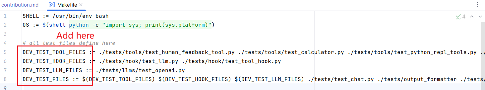

# Contributing to Promptulate

Hi there! Thank you for even being interested in contributing to Promptulate. As an open-source project in a rapidly developing field, we are extremely open to contributions, whether they involve new features, improved infrastructure, better documentation, or bug fixes.

## 1. Guidelines

### 👩‍💻 1.1 Contributing Code

To contribute to this project, please follow the ["fork and pull request"](https://docs.github.com/en/get-started/quickstart/contributing-to-projects) workflow.
Please do not try to push directly to this repo unless you are a maintainer.

Please follow the checked-in pull request template when opening pull requests. Note related issues and tag relevant
maintainers.

Pull requests cannot land without passing the formatting, linting, and testing checks first. See [Testing](#testing) and
[Formatting and Linting](#formatting-and-linting) for how to run these checks locally.

It's essential that we maintain great documentation and testing. If you:
- Fix a bug
  - Add a relevant unit or integration test when possible. These live in `tests`.
- Make an improvement
  - Update any affected example notebooks and documentation. These live in `docs`.
  - Update unit and integration tests when relevant.
- Add a feature
  - Add a demo notebook in `docs/`.
  - Add unit and integration tests.

We are a small, progress-oriented team. If there's something you'd like to add or change, opening a pull request is the
best way to get our attention.

### 🚩 1.2 GitHub Issues

Our [issues](https://github.com/Undertone0809/promptulate/issues) page is kept up to date with bugs, improvements, and feature requests.

There is a taxonomy of labels to help with sorting and discovery of issues of interest. Please use these to help organize issues.

If you start working on an issue, please assign it to yourself.

If you are adding an issue, please try to keep it focused on a single, modular bug/improvement/feature.
If two issues are related, or blocking, please link them rather than combining them.

We will try to keep these issues as up-to-date as possible, though
with the rapid rate of development in this field some may get out of date.
If you notice this happening, please let us know.

### 🙋 1.3 Getting Help

Our goal is to have the simplest developer setup possible. Should you experience any difficulty getting setup, please
contact a maintainer! Not only do we want to help get you unblocked, but we also want to make sure that the process is
smooth for future contributors.

In a similar vein, we do enforce certain linting, formatting, and documentation standards in the codebase.
If you are finding these difficult (or even just annoying) to work with, feel free to contact a maintainer for help -
we do not want these to get in the way of getting good code into the codebase.

## 🚀 2. Quick Start

This quick start guide explains how to run the repository locally. Before quick start, there are some concepts you need to know.

**Poetry**: This project utilizes [Poetry](https://python-poetry.org/) v1.6.1+ as a dependency manager.

**Conda**: We recommend you to use [Conda](https://docs.conda.io/en/latest/) as your environment/package manager when you are developing.

**Make**: This project uses make to build supporting facilities for the project. With the ability of makefiles, it is easy to integrate and run modules such as test and lint. Please ensure that make is installed on your computer.

**ruff**: This project uses [ruff](https://docs.astral.sh/ruff/) to manage the project's code format and type check. 

**GitHub Actions**: This project use GitHub Actions to check the code. When you create a PR, promptulate will start a GitHub action to check the code. Make sure that the code can pass the check before you create the PR. 

### 2.1 Build development environment

**Basic Environment**
- Python >= 3.8
- make
- Conda (Recommend, not required)

> This project uses make to build supporting facilities for the project. With the ability of makefiles, it is easy to integrate and run modules such as test and lint. Please ensure that make is installed on your computer.
> 
> [how to install and use make in windows?](https://stackoverflow.com/questions/32127524/how-to-install-and-use-make-in-windows)

1. Clone the latest code: 

```shell
git clone https://github.com/Undertone0809/promptulate 
```

2. Create a conda environment and activate it.

> Conda is recommended, not required. You can also use other virtual environments such as venv.

```shell
conda create -n promptulate python=3.10
conda activate promptulate
```

3. Install third-party packages:

```shell
cd promptulate
pip install poetry
make install
```

Integrated test contains some third-party packages. If you need to run integration tests, you need to install by the following commend:

```bash
pip install poetry
make install-integration 
```

Here, we have finished the installation of the development environment. 

### 2.2 Development and push code

When you create a PR, promptulate will start a GitHub action to check the code. Make sure that the code can pass the check before you create the PR. If you want to develop and push code, you need to follow the following steps:

1. Change your code
2. Code check

Before you commit the code, you should start the code check to ensure that the code is in the correct format and can pass the unit test. You need to run the following command:

```shell
make lint
```

`make lint` will run the code formatting and unit test. If the code formatting is not correct, you can run the following command to format the code:

```shell
make format
```

You can run the `make test` command to run the unit test. If you add new code, you need to add the corresponding unit test in `tests/`.

After that, you should add corresponding test file directory in `Makefile`.



3. Commit your code, create the PR after passing the code check

Any question, please contact us or create an [issue](https://github.com/Undertone0809/promptulate/issues).

### 2.3 Edit the documentation

This project utilizes [vitepress](https://vitepress.dev/) to build documentation. 

If you want to edit the documentation, you can edit `/docs` directory. After that, if you want to startup the documentation server and see the effect, you can run the following command:

```bash
# install vitepress
cd docs
npm i # or pnpm i
```

Run the following command to startup the documentation server:

```bash
npm run dev
```

When you add a new feature, you are recommended to add a demo notebook in `example/`. Moreover, you can add corresponding documentation in `docs/`.

Moreover, you need add sidebar information in `docs/.vitepress/config.mts` after you add the new documentation. eg:

```ts
export const sidebar = [
  {
    text: 'Guide',
    items: [
      // add your sidebar information in relevant directory
      { text: 'Getting Started', link: '/guide/getting-started' },
      { text: 'How to write model name', link: '/guide/how-to-write-model-name' },
      ... // other sidebar information
    ],
  },
]
```
