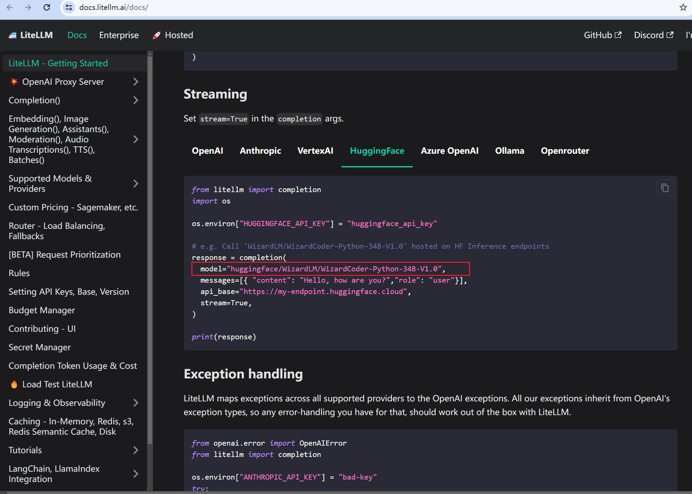

# How to write model name?

In some cases, you may need to specify the model name when using the `pne.chat()`, `pne.LLMFactory.build()` or other functions. In pne, we use the same pattern to specify the model name.

The model name is a string that identifies the model you want to use. The model name is usually a combination of the model provider and the model name, separated by a forward slash (`/`), eg: `deepseek/deepseek-chat` is a `provider/model-name`

## Create OpenAI Model

Now let's see how to write the model name, the following example use pne.chat() as an example:

```python
import pne

response = pne.chat(
    model="gpt-3.5-turbo",
    messages="Hello, how are you?",
)
print(response)
```

The same model name, you can use it in LLMFactory:

```python
import pne

model = pne.LLMFactory.build(model_mame="gpt-3.5-turbo")
```

## Create Deepseek chat model

```python
import pne

response = pne.chat(
    model="deepseek/deepseek-chat",
    messages="Hello, how are you?",
)
print(response)
```

## Why not provider name in OpenAI model?

For some well-known models, we use the model name directly without specifying the provider name. For example, for the OpenAI series of models, we only need to specify the model name, such as' gpt-3.5-turbo '. The same is true for Anthropic models, if you want to use Claude2, just specify 'model_name=claude2'.

pne integrates litellm's capabilities and model name standards, so if you want to use any model, you can go directly to the [litellm](https://docs.litellm.ai/docs/) website to view the model name and then use it in pne.


## See how to write model name by litellm

The following example show how to write model name if you want to use a huggingface model `WizardLM/WizardCoder-Python-34B-V1.0`.

First, you need to find the model name in the [litellm](https://docs.litellm.ai/docs/) website.

Copy the following image usage.



Then, you can use the model name in pne:

```python
import pne

response = pne.chat(
    model="WizardLM/WizardCoder-Python-34B-V1.0",
    messages="Hello, how are you?",
    model_config={"api_base": "https://my-endpoint.huggingface.cloud"}
)
```

## Zhipu