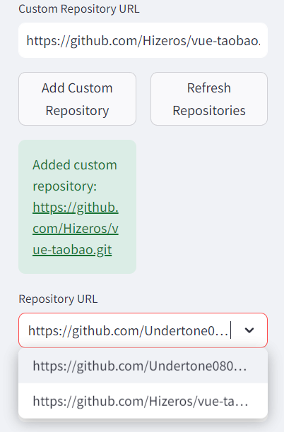
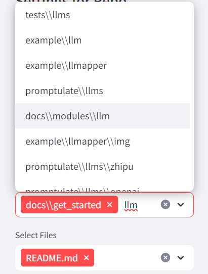

# Build a chatbot using pne-streamlit to chat with GitHub repo 
This is an example of building a chatbot for GitHub repo using streamlit and promptulate.

## Sample Output
Chat with GitHub Repo Using 200k context window of Claude instead of RAG!


## Why RepoChat - No RAG?

Take the advantage of Claude 200k! Put all examples and codes to the contexts!

**We need copilot rather than agent sometimes!**

### 1. Not just Chat, But Write Codes with the Lastest Documents

Have troubles memorizing all the apis in llama-index or langchain? 

No worries, just include the components examples and the documents from the repo and let Claude Opus - the strongest model and long context window of 200k to write your agent for you!

### 2. No copy and paste, Just Select



Download/Clone your Repo from GitHub then just select the files you'd like, I got you covered on constructing the prompt.

### 3. No RAG, You decide

I've seen many Chat with Repo projects, they all have the painpoints:

`Which files do this query need?`

They use **embedding search** in Code database but most of the time I already knew what documents I'm refering... So make your own choices each time when you are coding.

- Coding Frontend? Just select components and examples.

- Coding Agents? Just select Jupyter Notebook of langgraph.

- Coding RAG? Just select Jupyter Notebook of llamaindex.




# Quick Start

You can use the following command to run the project quickly:

- Click [here](https://github.com/Undertone0809/promptulate/fork) to fork the project to your local machine

- Clone the project locally:

```shell
git clone https://www.github.com/Undertone0809/promptulate
```

Switch the current directory to the example

```shell
cd ./example/chat-to-github-repo
```

Install the dependencies

```shell
pip install -r requirements.txt
```

Run the application

```shell
streamlit run app.py
```

# Role of each document 
1. `app.py`: This is the main entry point of the application. It uses streamlit to build a chatbot interface. The chatbot is built using promptulate. The chatbot is able to chat with GitHub repo.
2. `config.py`: This is the configuration file for the application.
3. `repo_service.py`:Provides a comprehensive code warehouse management tool to handle various operations and data processing related to the code warehouse 
4. `token_counter.py`:Two functions are defined to calculate the number of tokens 