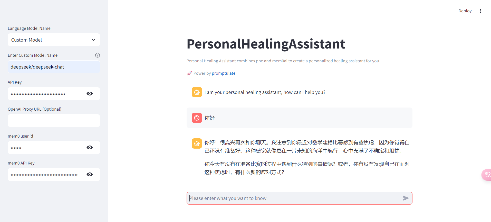

# Crafting your PersonalHealingAssistant with Streamlit and Mem0
Mem0 (pronounced “mem-zero”) enhances AI assistants and agents with an intelligent memory layer, enabling personalized AI interactions. 
Mem0 remembers user preferences, adapts to individual needs, and continuously improves over time, making it ideal for customer support chatbots, AI assistants, and autonomous systems.

This tutorial is an example of building a streamlit PersonalHealingAssistant using mem0.

## Environment Setup

We can start off by creating a new conda environment with python=3.11:`conda create -n streamlit_mem0 python=3.11`

Activate the environment:`conda activate streamlit_mem0`

Next, let’s install all necessary libraries:

```shell
pip install -U promptulate streamlit mem0ai
```

## Step-by-Step Implementation 

### Step 1

Create a `core.py` script and import the necessary dependencies:
```python
import pne
from mem0 import MemoryClient
```

### Step 2
Initialize the memory client:
```python
class PersonalHealingAssistant:
    def __init__(self):
        self.memory = None
        self.messages = [
            {"role": "system", "content": "You are a personal healing AI Assistant."}
        ]

    def set_mem0_api_key(self, mem0_api_key: str):
        self.memory = MemoryClient(api_key=mem0_api_key)

    def ask_question(self, question: str, user_id: str, config) -> str:
        # Fetch previous related memories
        previous_memories = self.search_memories(question, user_id=user_id)
        prompt = question
        if previous_memories:
            prompt = f"User input: {question}\n Previous memories: {previous_memories}"
        self.messages.append({"role": "user", "content": prompt})

        response = pne.chat(
            model=config.model_name,
            stream=True,
            messages=self.messages,
            model_config={"api_base": config.api_base, "api_key": config.api_key},
        )
        self.messages.append({"role": "assistant", "content": response})

        # Store the question in memory
        self.memory.add(question, user_id=user_id)
        return response

    def get_memories(self, user_id):
        memories = self.memory.get_all(user_id=user_id)
        return memories

    def search_memories(self, query, user_id):
        memories = self.memory.search(query, user_id=user_id)
        return memories
```
- Initialization: The PersonalTravelAssistant class is initialized with the OpenAI client and Mem0 memory setup.
- set mem0 api key: This method sets the Mem0 API key for memory access.
- Asking Questions: The ask_question method sends a question to the AI, incorporates previous memories, and stores new information.
- Memory Management: The get_memories and search_memories methods handle retrieval and searching of stored memories.

### Step 3
Create a `app.py` file:
```python
import pne
import streamlit as st
from core import PersonalHealingAssistant


def main():
    config = pne.beta.st.model_sidebar()
    with st.sidebar:
        mem0_user_id = st.text_input("mem0 user id", type="password")
        mem0_api_key = st.text_input(
            "mem0 API Key", key="provider_mem0_api_key", type="password"
        )

    st.title("PersonalHealingAssistant")
    st.caption(
        """
        Personal Healing Assistant combines pne and mem0ai to create a personalized healing assistant for you \n
        🚀 Power by [promptulate](https://github.com/Undertone0809/promptulate)
        """  # noqa
    )
    st.chat_message("assistant").write(
        "I am your personal healing assistant, how can I help you? "
    )

    ai_assistant = PersonalHealingAssistant()

    if prompt := st.chat_input("Please enter what you want to know "):
        if not config.api_key:
            st.info("Please add your model API key to continue.")
            st.stop()

        if not mem0_api_key:
            st.error("Please provide your mem0 API Key to continue.")
            st.stop()

        ai_assistant.set_mem0_api_key(mem0_api_key)

        answer = ai_assistant.ask_question(
            question=prompt, user_id=mem0_user_id, config=config
        )

        st.chat_message("user").write(prompt)
        st.chat_message("assistant").write_stream(answer)


if __name__ == "__main__":
    main()
```

## Output effect
```shell
cd path:/mem0 # Switch to your mem0 project directory 
streamlit run app.py
```

## Demo
There is a `app.py` file under the `mem0` file of `example` in the project folder. 
You can run the application directly to view the effect and debug the web page. 
Project Link: [streamlit-mem0](https://github.com/Undertone0809/promptulate/tree/main/example/mem0)
To run the application, follow the steps below:

- Click [here](https://github.com/Undertone0809/promptulate/fork) to fork the project to your local machine
- Clone the project locally:

```bash
git clone https://github.com/Undertone0809/promptulate.git
```

- Switch the current directory to the example

```shell
cd ./example/mem0
```

- Install the dependencies

```shell
pip install -r requirements.txt
```

- Run the application

```shell
streamlit run app.py
```

The running effect is as follows:
You can see that llm has read previous chat records,Therefore, it is possible to create personalized AI assistants for different users 

