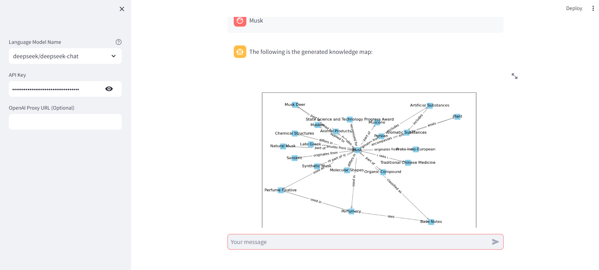

# LLMapper

An experiment in using LLMs, wikipedia and promptulate to draw simple concept maps.

LLMapper is a crude prototype for refining the prompts. Which is to say, this isn't (yet) a serious tool; it's a toy for learning about generative AI. 

It's very early days. Among other things, there's no error detection or graceful failures. Use at your own risk.

## Demo

You can see the online demo [here](https://pne-llmapper.streamlit.app/) and [source code](https://github.com/Undertone0809/promptulate/tree/main/example).

The Musk search operation effect is as follows: 




## Quick Start

You can use the following command to run the LLMapper project fastly:


- Click [here](https://github.com/Undertone0809/promptulate/fork) to fork the project to your local machine
- Clone the project locally:

```bash
git clone https://github.com/Undertone0809/promptulate.git
```

- Switch the current directory to the example

```shell
cd promptulate/example/llmapper
```

- Install the dependencies

```shell
pip install -r requirements.txt
```

- Run the application

```shell
streamlit run app.py
```


We can start off by creating a new conda environment with python=3.11:`conda create -n llmapper python=3.11`

Activate the environment:`conda activate llmapper`

Next, let’s install all necessary libraries:

```shell
pip install -U promptulate streamlit
```
## Step-by-Step Implementation 

### Step 1

Create a `core.py` script and import the necessary dependencies:

```python
from io import BytesIO
from typing import List

import matplotlib
import matplotlib.pyplot as plt
import networkx as nx
from pydantic import BaseModel, Field
```
Define core classes and functions for mapping knowledge 

```python
# Fixed the matplotlib font display issue
matplotlib.use("Agg")


class Node(BaseModel):
    id: str = Field(..., title="ID")
    title: str = Field(..., title="Title")


class Edge(BaseModel):
    from_: str = Field(..., title="From", alias="from")
    to: str = Field(..., title="To")
    title: str = Field(..., title="Title")


class LLMResponse(BaseModel):
    nodes: List[Node] = Field(..., title="Nodes")
    edges: List[Edge] = Field(..., title="Edges")


def create_knowledge_graph(data: dict):
    G = nx.DiGraph()
    # Add nodes and specify the layer attribute for each node
    for node in data["nodes"]:
        # The node ID is the number of tiers
        layer = node["id"]
        G.add_node(node["id"], title=node["title"], layer=layer)
    # Add a directed edge
    for edge in data["edges"]:
        G.add_edge(edge["from_"], edge["to"], title=edge["title"])
    return G


def draw_graph(G):
    # With spring layout,
    # it can be arranged vertically according to the hierarchical properties of nodes
    pos = nx.spring_layout(G, weight="layer")
    fig, ax = plt.subplots(figsize=(12, 8))
    
    # Draw nodes, where squares are used to represent nodes
    nx.draw_networkx_nodes(G, pos, node_shape="s", node_color="skyblue", ax=ax)
    
    # Draw edge
    nx.draw_networkx_edges(
    G, pos, edge_color="gray", arrowstyle="->", arrowsize=15, ax=ax
    )
    
    # Draw node label
    labels = nx.get_node_attributes(G, "title")
    nx.draw_networkx_labels(G, pos, labels=labels, font_size=12)
    
    # Draw the label of the edge
    edge_labels = nx.get_edge_attributes(G, "title")
    nx.draw_networkx_edge_labels(G, pos, edge_labels=edge_labels, font_size=10, ax=ax)
    
    # Save the graph to a BytesIO object
    buf = BytesIO()
    fig.savefig(buf, format="png")
    buf.seek(0)
    return buf


def read_summarize_prompt(file_path):
    with open(file_path, "r") as file:
        content = file.read()
    return content
```

### Step 2

Create a `prompt-summarize.md` script:

```markdown
# MISSION

You are an expert summarizer. You will examine an article and produce a list of concepts about the article and a list of relationships between those concepts.

# INPUT

You will be given the text of an article. This will be the sole source of information for your outline. Do not include any details that don't appear in the article.

# CONTEXT

Treat everything in the article as factual.

# METHODOLOGY

1. Start by summarizing the article.
2. Make a list of all concepts described in the article.
- A concept is a common or proper noun
- A concept cannot include more than one noun (it cannot include lists of nouns)
3. Focus only on the concepts that are most relevant to what this article is about and why it matters.
4. The first concept in the list is the main subject of the article
5. Take the first concept in the list and consider its relationship to all the other concepts in the list, and list the hierarchical relationship between the first concept and all the other concepts
6. Do the same thing for the second concept, and then every remaining concept in the list.

# OUTPUT
- Combine all of your understanding of the subject being summarized into a single, 20-word sentence. Do NOT mention the summary itself; focus only on the subject. Write it in a section called WHAT THIS IS:.

- Speculate about why this subject matters and write a single 20-word sentence that explains it in a section called WHY IT MATTERS:.

- Choose the 10 MOST IMPORTANT concepts in the article in order of importance. A concept is a common or proper noun that is a key part of the article. The most important concepts are those that help explain what this is and why it matters. Only include one concept per bullet. Don't include descriptions of each concept; only the concepts themselves. Include concepts that explain why this subject matters. The first concept in the list is the main subject of the article. Output the list in a section called MAIN CONCEPTS:.

- Write a list of how each concept in the MAIN CONCEPTS list relates to each of the other concepts in that list and their hierarchy.The hierarchical relationship between each concept is represented by an Arabic numeral corresponding to the id= hierarchy. ONLY USE CONCEPTS FROM THE CONCEPTS LIST. Do not introduce new concepts. Add each relationship to a list in the format "noun verb noun." DO NOT WRITE SENTENCES, only noun-verb-noun. Only include one object and subject in each bullet point. Consider how this concept relates to the main subject. Include relationships that help explain why this subject matters. Output that list in a section called RELATIONSHIPS:.

This is the format for the RELATIONSHIPS section:

- Bytedance owns TikTok
- Bytedance owns Douyin
- TikTok expanded globally

Only include ONE SUBJECT, ONE OBJECT, and ONE PREDICATE per bullet. Do not include adjectives or adverbs. Do not include lists in bullets.

Include as many relationships as necessary to represent ALL the concepts in the concepts list. Include at least 20 relationships in this list. DO NOT INCLUDE CONCEPTS THAT AREN'T PRESENT IN THE CONCEPTS LIST ABOVE.

# RULES

- Do not mention the article itself
- Do not mention references
- Write the summary in Markdown format
```

### Step 3

Create a `app.py` script and import the necessary dependencies:

```python
import streamlit as st
from core import LLMResponse, create_knowledge_graph, draw_graph, read_summarize_prompt

import promptulate as pne
from promptulate.tools.wikipedia import wikipedia_search
```

Create a sidebar to place the user parameter configuration:

```python
# Create a sidebar to place the user parameter configuration
with st.sidebar:
    model_name: str = st.selectbox(
    label="Language Model Name",
    options=[
    "openai/gpt-4o",
    "openai/gpt-4-turbo",
    "deepseek/deepseek-chat",
    "zhipu/glm-4",
    "ollama/llama2",
    ],
    help="For more details, please see"
    "[how to write model name?]("
    "https://www.promptulate.cn/#/other/how_to_write_model_name)",
    )
    api_key = st.text_input("API Key", key="provider_api_key", type="password")
    api_base = st.text_input("OpenAI Proxy URL (Optional)")
    "[View the source code](Your related core code link)"
```

Set page style:

```python
# Set title
st.title("💬 Chat")
st.caption(
"🚀 Hi there! 👋 I am a chatbot using llmapper to draw knowledge map by "
"Promptulate to help you."
)
# Determine whether to initialize the message variable
# otherwise initialize a message dictionary
if "messages" not in st.session_state:
    st.session_state["messages"] = [
    {"role": "assistant", "content": "How can I help you?"},]
# Traverse messages in session state
for msg in st.session_state.messages:
    st.chat_message(msg["role"]).write(msg["content"])
```

Set user input:

```python
# User input
if prompt := st.chat_input():
    if not api_key:
        st.info("Please add your API key to continue.")
        st.stop()
    # Display the user's message
    st.session_state.messages.append({"role": "user", "content": prompt})
    st.chat_message("user").write(prompt)
    
    query_result: str = wikipedia_search(prompt, top_k_results=1)
    # display search results in the chatbot panel
    # st.chat_message("assistant").write(query_result)
    
    summarize_prompt_path = "prompt-summarize.md"
    summarize_prompt = read_summarize_prompt(summarize_prompt_path)
    _prompt = f"""
    Please generate a knowledge graph based on the requirements of {summarize_prompt}
    and the content of {query_result}
    """
    
    llm_response: LLMResponse = pne.chat(
                                    model=model_name,
                                    messages=_prompt,
                                    model_config={"api_base": api_base, "api_key": api_key},
                                    output_schema=LLMResponse,)
    # Display the summarized concept list in the chatbot panel
    # st.chat_message("assistant").write(str(llm_response.model_dump()))
    
    # generate and draw the knowledge graph
    G = create_knowledge_graph(llm_response.model_dump())
    buf = draw_graph(G)
    # Convert the graph to a base64 image and display it
    st.session_state.messages.append({
        "role": "assistant",
        "content": "The following is the generated knowledge map:",})
    st.chat_message("assistant").write("The following is the generated knowledge map:")
    st.image(buf)
```


## Demo
There is a `app.py` file under the `llmapper` file of `example` in the project folder. 
You can run the application directly to view the effect and debug the web page.
To run the application, follow the steps below:

- Click [here](https://github.com/Undertone0809/promptulate/fork) to fork the project to your local machine
- Clone the project locally:

```bash
git clone https://github.com/Undertone0809/promptulate.git
```

- Switch the current directory to the example

```shell
cd ./example/llmapper
```

- Install the dependencies

```shell
pip install -r requirements.txt
```

- Run the application

```shell
streamlit run app.py
```