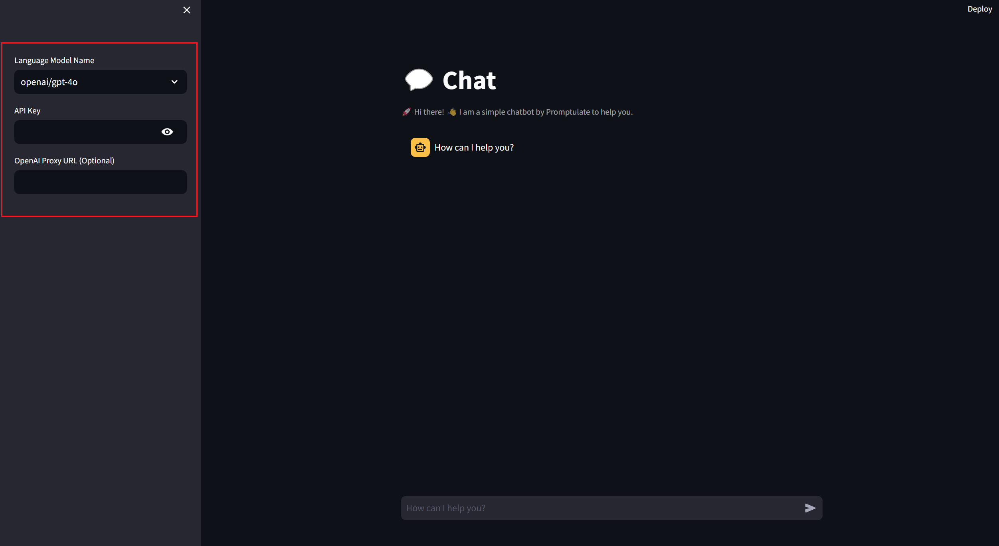
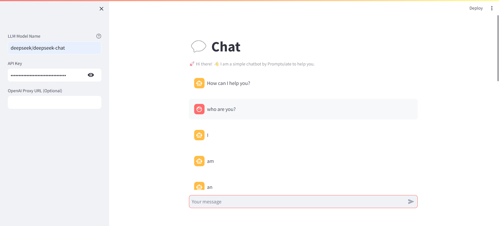

# Build a chatbot using streamlit

This demo is how to use `pne.chat()` to create a simple chatbot utilising any model. For the application frontend, there will be using streamlit, an easy-to-use open-source Python framework. 

This application is a template, meaning you can create your own LLM application by this template.

You see try the live demo at [https://pne-chatbot.streamlit.app/](https://pne-chatbot.streamlit.app/) or see the code [https://github.com/Undertone0809/promptulate/tree/main/example/streamlit-chatbot](https://github.com/Undertone0809/promptulate/tree/main/example/streamlit-chatbot).

<iframe src="https://pne-chatbot.streamlit.app/?embed=true" width="100%" height="600" style="border: none; border-radius: 4px; overflow: hidden;" allowfullscreen></iframe>

## Environment Setup

Now, let's install all necessary libraries:

```bash
pip install -U pne streamlit`
```

## Step-by-Step Implementation 

### Step 1

Create a `app.py` script and import the necessary dependencies:

```python
import pne
import streamlit as st
```

### Step 2

Create a sidebar to place the user parameter configuration. Pne has the streamlit model configuration UI built in, you can use it to quickly configure the model use the following code:

> pne.beta.st.model_sidebar() is currently in beta phase and is expected to be converted to the official version in v1.20.0

```python
import pne

config = pne.beta.st.model_sidebar()
print(config)
```

model_sidebar provide some models default options, you can also pass a list of model names to it if you want to customize the options.

Output:

```text
{'model_name': 'openai/gpt-4o', 'api_key': 'your api key', 'api_base': ''}
```

Render it like this:



The upper code is the same as the following code:

```python
from typing import List, TypedDict


class ModelConfig(TypedDict):
    model_name: str
    api_key: str
    api_base: str


def model_sidebar(model_options: List[str] = None) -> ModelConfig:
    import streamlit as st

    model_options = model_options or [
        "Custom Model",
        "openai/gpt-4o",
        "openai/gpt-4o-mini",
        "openai/gpt-4-turbo",
        "deepseek/deepseek-chat",
        "claude-3-5-sonnet-20240620",
        "zhipu/glm-4",
        "ollama/llama2",
        "groq/llama-3.1-70b-versatile",
    ]

    with st.sidebar:
        selected_model = st.selectbox("Language Model Name", model_options)

        if selected_model == "Custom Model":
            selected_model = st.text_input(
                "Enter Custom Model Name",
                placeholder="Custom model name, eg: groq/llama3-70b-8192",
                help="For more details, please see [how to write model name?](https://www.promptulate.cn/#/other/how_to_write_model_name)",  # noqa
            )

        api_key = st.text_input("API Key", key="provider_api_key", type="password")
        api_base = st.text_input("OpenAI Proxy URL (Optional)")

    return ModelConfig(model_name=selected_model, api_key=api_key, api_base=api_base)
```

### Step 3 

Set page style:

```python
# Set title
st.title("💬 Chat")
st.caption("🚀 Hi there! 👋 I am a simple chatbot by Promptulate to help you.")

# Determine whether to initialize the message variable
# otherwise initialize a message dictionary
if "messages" not in st.session_state:
    st.session_state["messages"] = [
        {"role": "assistant", "content": "How can I help you?"}
    ]

# Traverse messages in session state
for msg in st.session_state.messages:
    st.chat_message(msg["role"]).write(msg["content"])
```

### Step 4

Set user input:

```python
if prompt := st.chat_input("How can I help you?"):
    if not api_key:
        st.info("Please add your API key to continue.")
        st.stop()

    st.session_state.messages.append({"role": "user", "content": prompt})

    with st.chat_message("user"):
        st.markdown(prompt)

    with st.chat_message("assistant"):
        stream = pne.chat(
            model=model_name,
            stream=True,
            messages=st.session_state.messages,
            model_config={"api_base": api_base, "api_key": api_key},
        )
        response = st.write_stream(stream)
    st.session_state.messages.append({"role": "assistant", "content": response})
```

## Final Effect

The running effect is as follows, you can interact with the chatbot:



## How to write model name?

You can see how to write model name here: [Link](/other/how_to_write_model_name#how-to-write-model-name)

## Run the demo

There is a `app.py` file under the `streamlit-chatbot` file of `example` in the project folder. You can run the application directly to view the effect and debug the web page.

To run the application, follow the steps below:

- Click [here](https://github.com/Undertone0809/promptulate/fork) to fork the project to your local machine
- Clone the project locally:

```bash
git clone https://github.com/Undertone0809/promptulate.git
```

- Switch the current directory to the example

```shell
cd ./example/streamlit-chatbot
```

- Install the dependencies

```shell
pip install -r requirements.txt
```

- Run the application

```shell
streamlit run app.py
```
